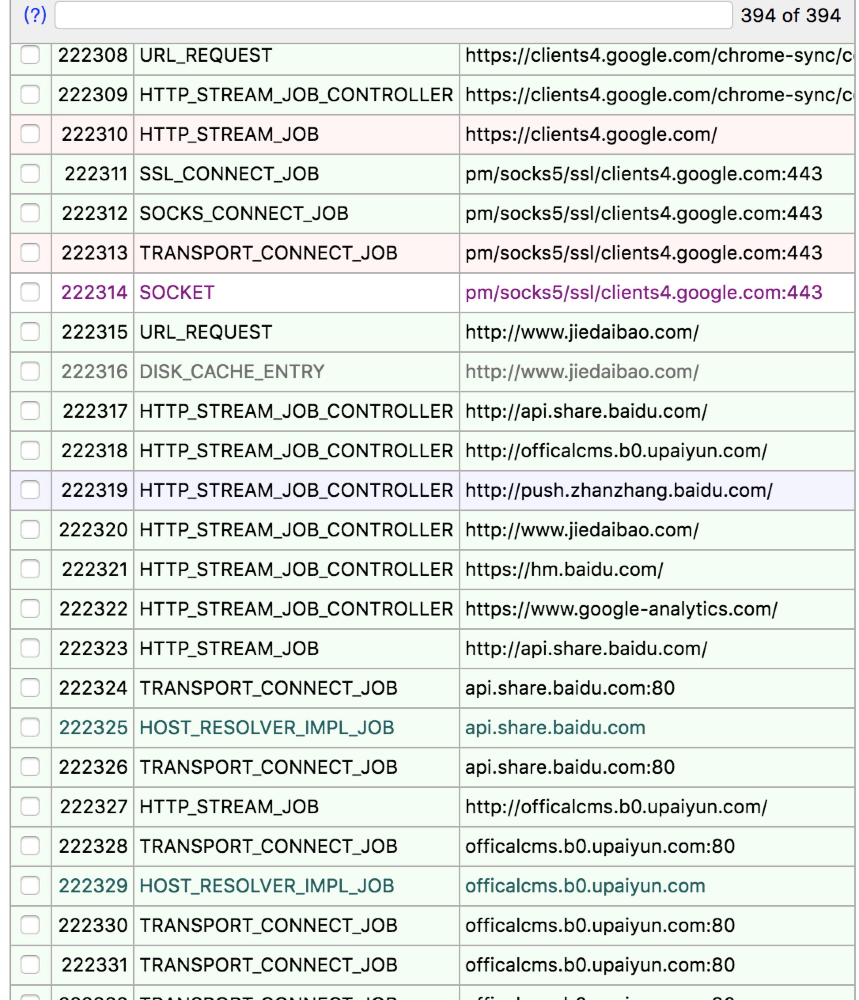
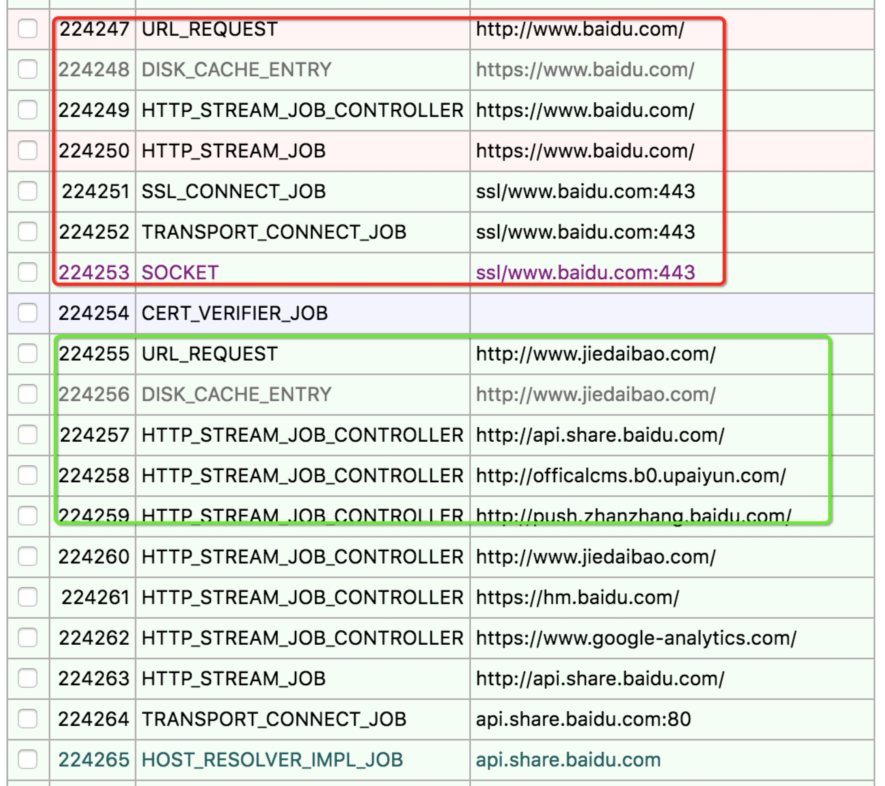

## location 打开行为与浏览器机制的关系


- 多次执行location.href 代码保证执行，浏览器是否发送请求，建立连接
```
var dom = document.getElementById('btn');
        var url1 = 'http://www.baidu.com/';
        var url2 = 'http://www.jiedaibao.com/';
        dom.onclick = function () {
            window.location.href = url1;
            window.location.href = url2;
        }
```
结果是打开`借贷宝`,window.location.href = url1; 这行代码是被执行了的，但是没有并没有建立连接
通过chrome://net-internals/#events 来分析，



- 设置延迟
```
var dom = document.getElementById('btn');
var url1 = 'http://www.baidu.com/';
var url2 = 'http://www.jiedaibao.com/';
dom.onclick = function () {
    window.location.href = url1;
    setTimeout( () => {
        window.location.href = url2;
    },200);
}
```
结果依然是打开`借贷宝`,这时候window.location.href = url1也是被执行了，有没有请求百度呢？
结论是：请求百度了，并且建立了连接请求，然后并未进行跳转，然后被后面的借贷宝跳转覆盖了



- 那么接下来需要确定的是，浏览器什么时候会出发对location的站点进行连接，什么时候进行跳转?
```
var dom = document.getElementById('btn');
        var url1 = 'http://www.baidu.com/';
        var url2 = 'http://www.jiedaibao.com/';
        window.onunload = function() {
            console.log('onunload.....');
        }
        dom.onclick = function () {
            window.location.href = url1;
            setTimeout( () => {
                console.log('==================.....');
                window.location.href = url2;
            },375);
        }
```
这段代码的测试结果是：大部分情况下会跳转百度，小部分情况下会跳转借贷宝，这就比较有意思了，抓包情况显示，跳转百度的情况是请求百度整个time在375ms内，然后触发onload的，这时候375的定时器不会被执行了，当前网页被卸载，跳转借贷宝的是375ms 百度doc 没有返回，没有触发unload，这时候延迟被执行，强制cacel掉了对百度的请求，然后在触发unload