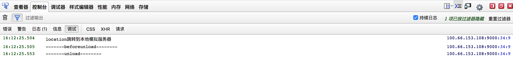
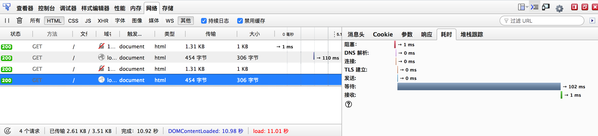
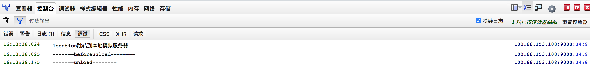
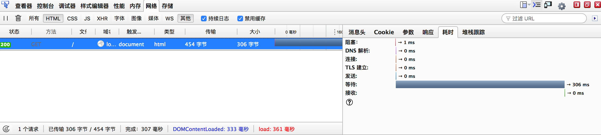
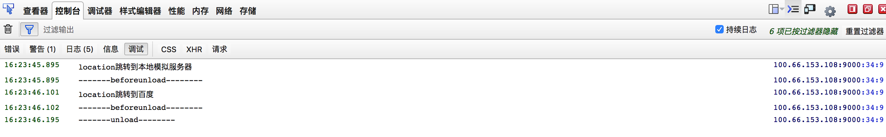

## location 打开行为与浏览器机制的关系

- 问题 
  两次更改location.href值，最终浏览器打开的是哪个页面？
  ```
      var dom = document.getElementById('btn');
      var url1 = 'http://localhost:3000/';
      var url2 = 'http://www.baidu.com/';
      dom.onclick = function () {
        log('location跳转到本地模拟服务器');
        window.location.href = url1;
        setTimeout(() => {
          log('location跳转到百度')
          window.location.href = url2;
        }, 200);
      }
      window.onunload = function () {
        log('-------unload--------')
      }
      window.onbeforeunload = function () {
        log('-------beforeunload--------')
      }
      
      function log(info){
        console.debug(info);
      }
  ```


- onbeforeunload 、onunload
  - 相同点：
    - 都是在浏览器刷新、location改变或者关闭时触发（ps：不同浏览器或者版本，存在差异性）
  - 不同点：
    - Onbeforeunload是正要去服务器读 取新的页面时调用，此时还没开始读取；而onunload则已经从服务器上读到了需要加载的新的页面，在即将替换掉当前页面时调用。unload之后当前的js执行环境就会被销毁，无法执行后续代码。
    - Onunload是无法阻止页面的更新和关闭的。而 Onbeforeunload 可以做到
      
- 代码测试逻辑
  - 在跳转点击、beforeunload、unload等事件触发时打印日志
  - 本地启动静态资源服务器，用于模拟网络请求，方便设置延迟并且误差较小
  - 查看网络请求test.html（本地服务器）timing，并查看log输出情况
  - 设置不同网络延迟，获取不同结果
    
- 测试结果
  ```
      1、网络请求不加延迟，内部修改location延迟200ms，结果跳转到本地
      2、增加100ms延迟,内部修改location延迟200ms，结果跳转到本地
      3、增加200ms延迟,内部修改location延迟200ms，结果跳转到百度
      4、增加300ms延迟,内部修改location延迟200ms，结果跳转到百度
  ```
  * 以下分别是上述四中情况的日志和网络截图
  
  
  
  
  
  
  
  
  
- 推论
    
  - 两次跳转结果不一致的原因，主要取决于unload事件执行时间，而unload事件触发时间受网络请求中的TTFB影响。
